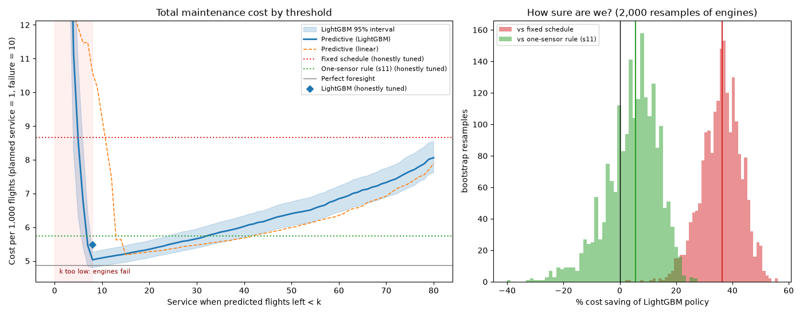

# Predictive Maintenance: Turbofan Engines

Predict how many flights each engine has left (remaining useful life, RUL) from sensor data, turn that into a maintenance policy, and price it against a fixed service schedule. Built on NASA's C-MAPSS turbofan simulation.

**Result:** servicing on predicted condition cuts total maintenance cost by **~37% vs. a fixed schedule** (95% range 21–49%), assuming an unplanned failure costs 10× a planned service. The ML model is **not yet proven better than a simple one-sensor rule**, and it breaks when a new failure mode appears. A nightly drift check catches that. Full details are in [MODEL_CARD.md](MODEL_CARD.md), and a plain-language overview is in [PROBLEM.md](PROBLEM.md).



## Setup

Requires [uv](https://docs.astral.sh/uv/) and Node 20+.

```bash
uv sync
# Download NASA C-MAPSS into data/raw/
mkdir -p data/raw && cd data/raw
curl -L -o cmapss.zip "https://phm-datasets.s3.amazonaws.com/NASA/6.+Turbofan+Engine+Degradation+Simulation+Data+Set.zip"
unzip -q cmapss.zip && unzip -q -o "6. Turbofan Engine Degradation Simulation Data Set/CMAPSSData.zip" && cd ../..
```

## Pipeline

| Step | Command | Output |
|---|---|---|
| Explore | `uv run python src/explore.py` or `notebooks/01_explore.ipynb` | `reports/fd001_sensors.png` |
| Train (linear, LightGBM, leakage demo) | `uv run python src/train.py` | `models/`, MLflow runs |
| Cost policy and bootstrap | `uv run python src/policy.py` | `reports/cost_curve.png` |
| FD003 generalization test | `uv run python src/generalize.py` | `reports/fd003_generalization.png` |
| Drift report | `uv run python src/drift.py` | `reports/drift*.md`, `reports/drift.png` |
| Work-order API | `uv run uvicorn api:app --app-dir src` | http://127.0.0.1:8000/docs |
| Nightly batch job | `uv run python src/batch.py` | work orders, `reports/scores_*.csv` |
| Dashboard data | `uv run python src/export_dashboard.py` | `frontend/public/data.json` |

Experiments: `uv run mlflow ui --backend-store-uri sqlite:///mlflow.db`

## Dashboard

```bash
cd frontend && npm install && npm run dev   # http://localhost:5173
```

A React + Recharts page that walks through the problem, the model, the money, the FD003 stress test, drift and live work orders. With the API running, work orders load live.

## Project layout

```
src/        data loading, labels, features, training, policy simulation, drift, API, batch job
frontend/   React dashboard
notebooks/  exploration playground
reports/    charts and reports produced by the pipeline
```
